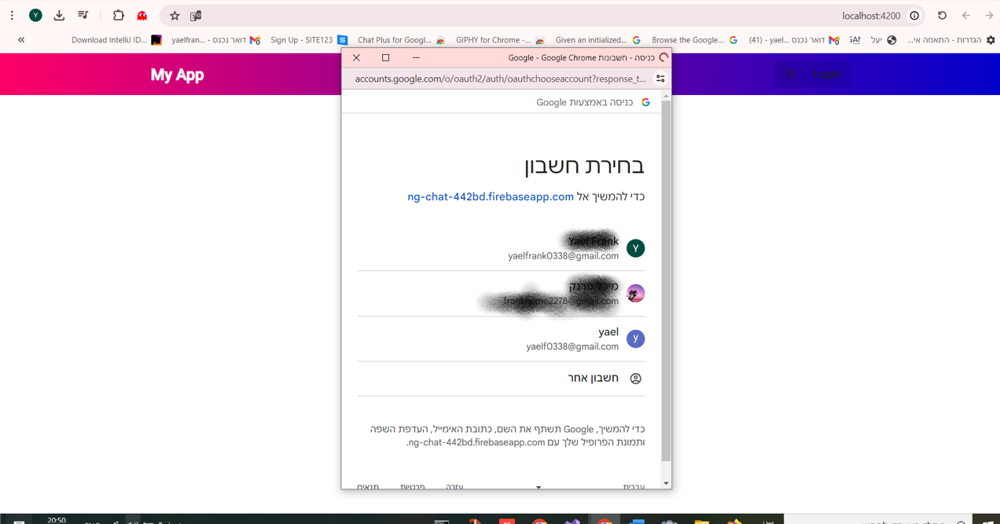

# NgChat

This project is a feature-rich chat application built with Angular. It includes Google authentication, the ability to create new chat rooms, real-time messaging, and integration with Firebase for database management.

## Features

- **Google Authentication**: Secure and easy login with Google accounts.
- **Create Chat Rooms**: Users can create and join multiple chat rooms.
- **Real-Time Messaging**: Send and receive messages instantly.
- **Firebase Integration**: Stores messages and chat room data in Firebase.

## Development Server

Run `ng serve` for a dev server. Navigate to `http://localhost:4200/`. The application will automatically reload if you change any of the source files.

## Code Scaffolding

Run `ng generate component component-name` to generate a new component. You can also use `ng generate directive|pipe|service|class|guard|interface|enum|module`.

## Build

Run `ng build` to build the project. The build artifacts will be stored in the `dist/` directory.

## Running Unit Tests

Run `ng test` to execute the unit tests via [Karma](https://karma-runner.github.io).

## Running End-to-End Tests

Run `ng e2e` to execute the end-to-end tests via a platform of your choice. To use this command, you need to first add a package that implements end-to-end testing capabilities.

## Further Help

To get more help on the Angular CLI use `ng help` or go check out the [Angular CLI Overview and Command Reference](https://angular.io/cli) page.

## Screenshots

*Example of the chat room interface.*

## How to Contribute

If you want to contribute to this project, feel free to open an issue or submit a pull request.
