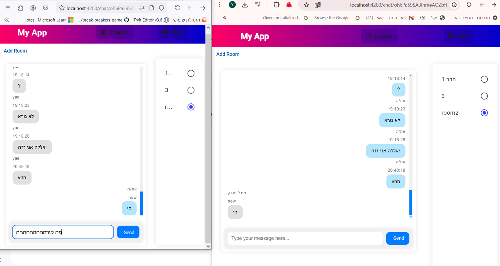

# NgChat

This project is a cutting-edge chat application built with Angular, designed to offer a seamless and interactive communication experience. With its modern features and robust backend integration, NgChat ensures efficient and real-time messaging for users.

## Features

- **Google Authentication**: Secure and easy login with Google accounts, ensuring user safety and data privacy.
- **Create Chat Rooms**: Users can effortlessly create and join multiple chat rooms, allowing for diverse conversation channels.
- **Real-Time Messaging**: Experience instant messaging with real-time updates and notifications.
- **Firebase Integration**: Robust data storage with Firebase, ensuring reliable and scalable backend support.
- **Responsive Design**: Optimized for all devices, providing a consistent experience across desktops, tablets, and mobile phones.
- **User-Friendly Interface**: Intuitive and clean UI/UX design, enhancing user engagement and satisfaction.
- **High Performance**: Built with Angular, offering high-speed performance and smooth interactions.

## Development Server

Run `ng serve` for a dev server. Navigate to `http://localhost:4200/`. The application will automatically reload if you change any of the source files.

## Code Scaffolding

Run `ng generate component component-name` to generate a new component. You can also use `ng generate directive|pipe|service|class|guard|interface|enum|module`.

## Build

Run `ng build` to build the project. The build artifacts will be stored in the `dist/` directory.

## Running Unit Tests

Run `ng test` to execute the unit tests via [Karma](https://karma-runner.github.io).

## Running End-to-End Tests

Run `ng e2e` to execute the end-to-end tests via a platform of your choice. To use this command, you need to first add a package that implements end-to-end testing capabilities.

## Further Help

To get more help on the Angular CLI use `ng help` or go check out the [Angular CLI Overview and Command Reference](https://angular.io/cli) page.

## Screenshots

*Example of the chat room interface.*

## How to Contribute

If you want to contribute to this project, feel free to open an issue or submit a pull request.

## Future Enhancements

- **Video and Voice Chat**: Integration of video and voice communication for more dynamic interactions.
- **Advanced Notifications**: Customizable notification settings for users.
- **AI-Powered Chatbots**: Implementation of AI chatbots to assist users and provide automated responses.
- **Enhanced Security Features**: Additional security layers such as two-factor authentication and end-to-end encryption.

## Community and Support

Join our community on [Discord](https://discord.gg/your-link) or follow us on [Twitter](https://twitter.com/your-link) for the latest updates. If you encounter any issues, please reach out via our [support page](https://support.your-link.com).

## License

This project is licensed under the MIT License - see the [LICENSE](LICENSE) file for details.
